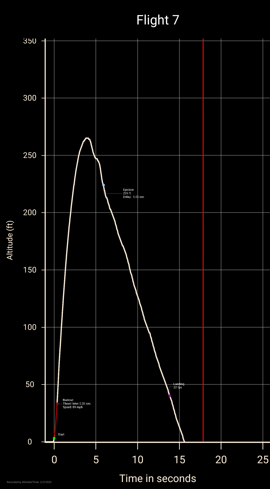
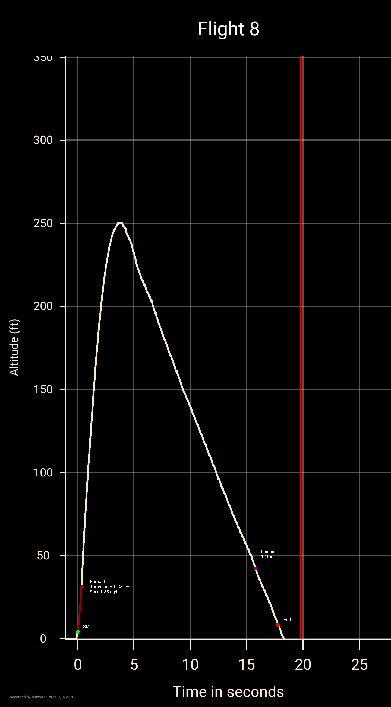

# rocketo
Engineering 2 rocket code for deploying parachute based on accelerometer readings

## Succesfull deployment flight flogs 

  
  

## Wierd things to note 
Having more than one sensor active on the 33 ble does create an offset for other sensors  probably due to voltage issues.  
You have to turn the 33 ble on and off to use the IMU. Pressing the reset button will sometimes cause it to fail initializing. 
